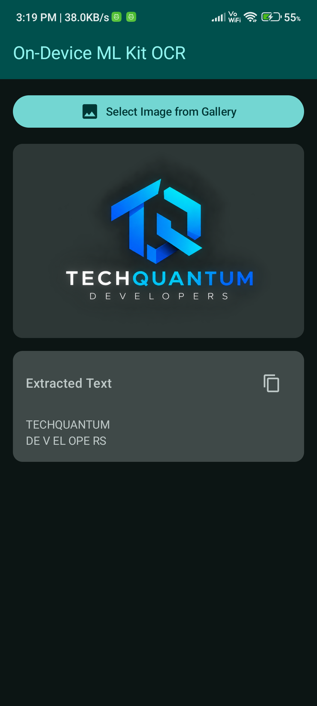

# AI-First Development: On-Device Text Recognition (OCR)

An Android application demonstrating **On-Device Artificial Intelligence** using **Google ML Kit Text Recognition v2** and **Jetpack Compose (Material 3)**.

<p align="center">
  
</p>

---

## 🌟 Highlights

- **100% On-Device & Offline**: Processes images locally on the device hardware (CPU/GPU/NPU). No network latency, no cloud API costs, zero data sent to external servers.
- **Privacy-First**: User photos remain strictly on the device.
- **Ultra-Lightweight APK**: Employs Google Play Services dynamic thin modules, adding less than 1 MB to the final APK size.
- **Modern Android Photo Picker**: Uses `ActivityResultContracts.PickVisualMedia` with zero storage permissions required (`READ_EXTERNAL_STORAGE` not needed).
- **Jetpack Compose UI**: Built entirely with Material 3, featuring real-time loading spinners, robust error handling, and one-click copy to clipboard.

---

## 🏗️ Architecture & Pipeline

```text
[User selects image via Photo Picker]
                 │
                 ▼
       [Obtain Content Uri]
                 │
                 ▼
[InputImage.fromFilePath(context, uri)]
                 │
                 ▼
[recognizer.process(inputImage)]  ───► Runs local ML model on device
                 │
                 ├──► [onSuccess] ──► Update Compose State with visionText.text
                 └──► [onFailure] ──► Display Error in Material 3 Card
```

---

## 🛠️ Tech Stack & Dependencies

- **Language**: Kotlin
- **UI Framework**: Jetpack Compose with Material 3
- **Image Loading**: [Coil](https://coil-kt.github.io/coil/) (`io.coil-kt:coil-compose`)
- **Machine Learning**: [Google ML Kit Text Recognition v2](https://developers.google.com/ml-kit/vision/text-recognition/v2/android) (`com.google.android.gms:play-services-mlkit-text-recognition`)

### `app/build.gradle.kts`
```kotlin
dependencies {
    // Jetpack Compose & Material 3
    implementation(platform(libs.androidx.compose.bom))
    implementation(libs.androidx.compose.material3)
    implementation(libs.androidx.compose.material.icons.extended)

    // ML Kit Text Recognition (Play Services unbundled version)
    implementation("com.google.android.gms:play-services-mlkit-text-recognition:19.0.1")

    // Image loading for Compose
    implementation("io.coil-kt:coil-compose:2.7.0")
}
```

### `AndroidManifest.xml` Configuration
To instruct Google Play to pre-download the OCR model when the app is installed from the Play Store:

```xml
<application ...>
    <meta-data
        android:name="com.google.mlkit.vision.DEPENDENCIES"
        android:value="ocr" />
</application>
```

---

## 🔍 On-Device vs Cloud OCR

| Metric | On-Device (ML Kit) | Cloud Vision API |
| :--- | :--- | :--- |
| **Internet Requirement** | **None** (Works offline) | Mandatory active connection |
| **Cost** | **Free** (Unlimited scans) | Pay-per-request / Monthly quotas |
| **Latency** | Instant (~50-150 ms) | Network roundtrip (~1-3 seconds) |
| **Privacy** | 100% on-device | Images sent to cloud servers |
| **Target Use-Case** | Printed text, documents, receipts, boards | Complex cursive scripts & dense handwriting |

---

## 📱 Model Distribution Models

1. **Unbundled (Default in this project)**:
   - Dependency: `com.google.android.gms:play-services-mlkit-text-recognition`
   - Model is shared via **Google Play Services**.
   - APK size increase: **~500 KB**.
   - Automatically loaded from the device cache if already downloaded by other Google apps (e.g., Google Lens, Translate).

2. **Bundled (Alternative for non-GMS devices)**:
   - Dependency: `com.google.mlkit:text-recognition`
   - Model weights are packaged directly inside the APK.
   - APK size increase: **~10-12 MB**.
   - Works immediately on fresh devices without Google Play Services or network access.

---

## 🚀 Getting Started

1. Clone or open the repository in **Android Studio (Ladybug or newer)**.
2. Sync the project with Gradle files.
3. Run on an Android device or emulator with Google Play Services (API 23+).
4. Launch the app, pick any image containing printed text from the gallery, and view the extracted text instantly.